# Strapi Chatbot Plugin

An AI-powered FAQ chatbot plugin for Strapi. Drop it into any Strapi project and get an intelligent FAQ assistant in your admin panel.

> ⚠️ **Note:** To test the chatbot API, you can use the [**_nui-strapi-chatbot-react_**](https://www.npmjs.com/package/nui-strapi-chatbot-react) package as a simple frontend UI.

[](https://nodejs.org/)
[](https://www.npmjs.com/package/nui-strapi-chatbot-plugin)


---

## 📦 Installation

```bash
# npm
npm install nui-strapi-chatbot-plugin@latest

# yarn
yarn add nui-strapi-chatbot-plugin@latest

# pnpm
pnpm add nui-strapi-chatbot-plugin@latest
```

---

## 🚀 Build & Start

```bash
npm run build
npm run develop
```

---

## 💡 Usage

1. Start your Strapi app.

2. Open the admin panel and navigate to **NUI Chatbot Configuration** in the sidebar.
<p align="center">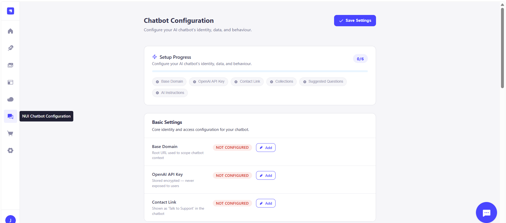</p>

3. Set up your [OpenAI API key](https://platform.openai.com/settings/organization/api-keys). Make sure **`gpt-4o-mini`** and **`text-embedding-3-small`** models are available on your account.
<p align="center">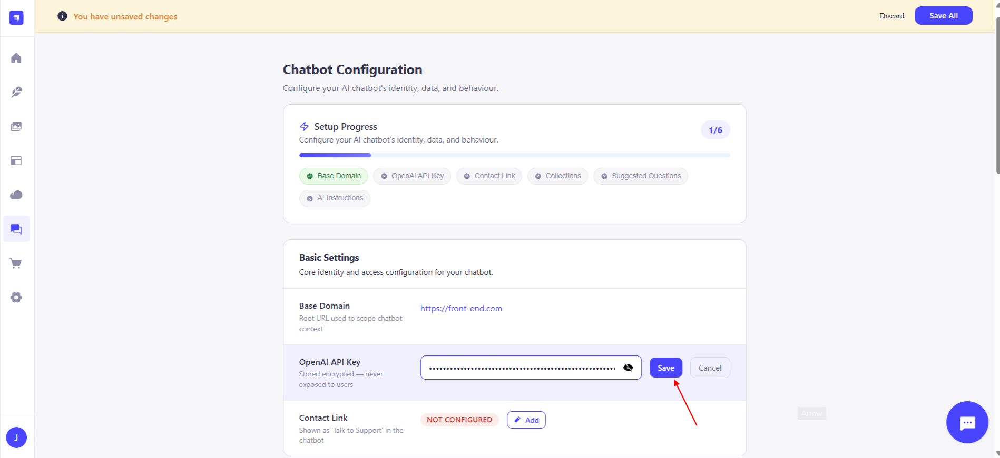</p>

4. Clicking **_Save_** will validate the API key and save it.
<p align="center">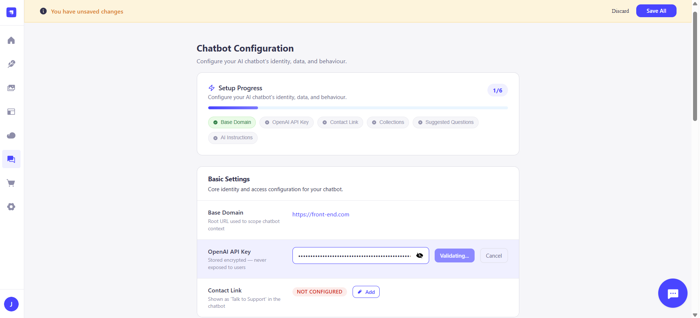</p>

5. Add your frontend base domain (used to resolve card assets from its public folder).
<p align="center">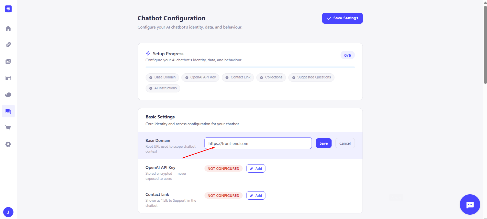</p>

6. Add a contact link so the AI can provide it to users on request.
<p align="center">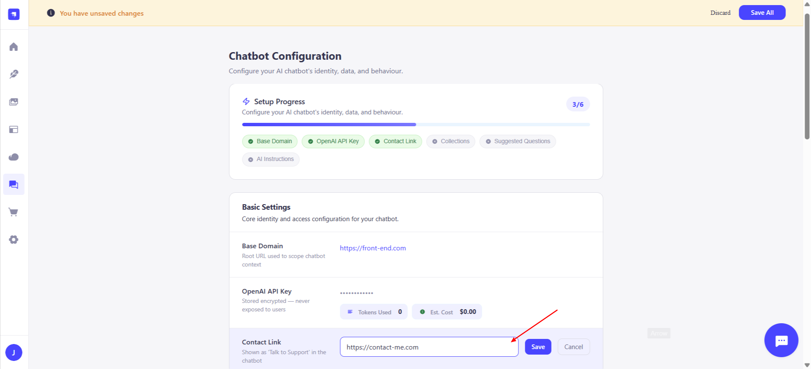</p>

7. Save the configuration.
<p align="center">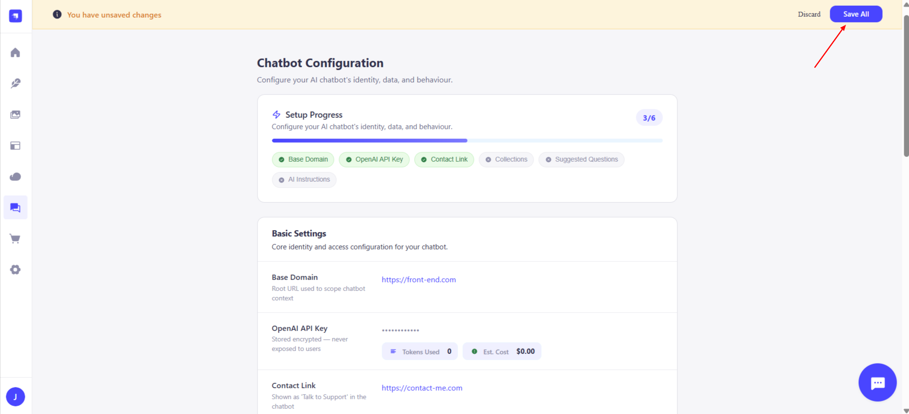</p>

8. Add your FAQ entries in the **Chatbot-FAQ** collection.
<p align="center">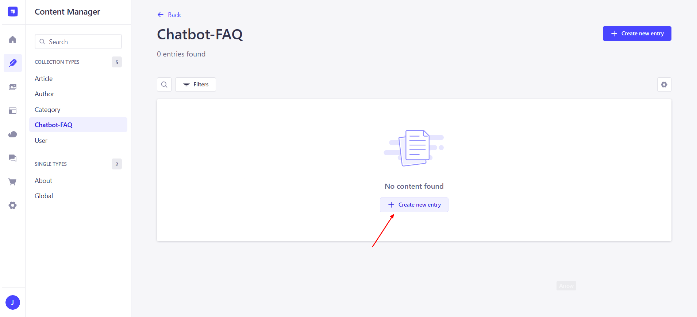</p>

9. The chatbot is ready to use — test it directly from the admin panel.
<p align="center">
  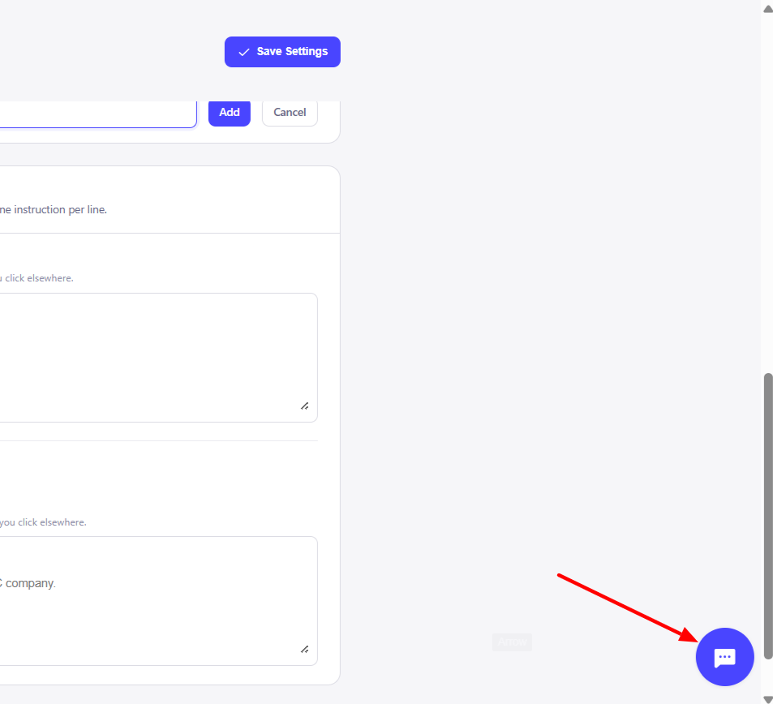
  &nbsp;
  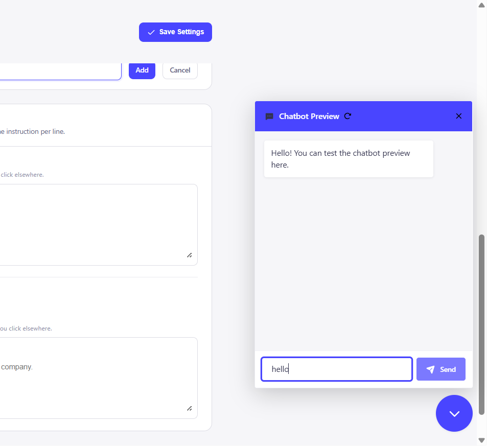
</p>

---

## 🔄 Updating

```bash
npm install nui-strapi-chatbot-plugin@latest

# Then rebuild and restart
npm run build && npm run develop
```

---

## 🔒 Security

- **Admin endpoints** (`/collections`, `/usage`, `/validate-key`) require Strapi admin authentication and are not publicly accessible.
- **Your OpenAI API key** is stored in the Strapi plugin store and is never returned to the browser in plaintext.
- **The `/ask` endpoint** is public (required by the frontend chatbot widget). In production, apply rate limiting at your reverse-proxy or CDN to prevent billing abuse.

---

## ⚠️ Troubleshooting

- Make sure the base domain is set correctly before testing.
- Only add FAQ entries to the **Chatbot-FAQ** collection after providing a valid API key.
- If you see a version mismatch during install, run:

  ```bash
  npm install --legacy-peer-deps
  ```

---

## Additional Information

- **Response Template**
  - Add collections for AI to query realtime data
    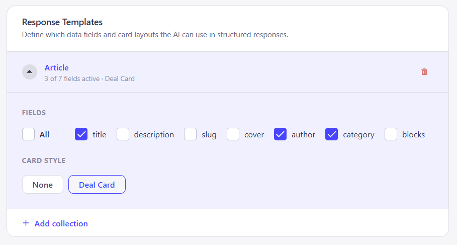

- **Suggested Questions**
  - Add questions so that it can be fetched in frontend as suggestions
    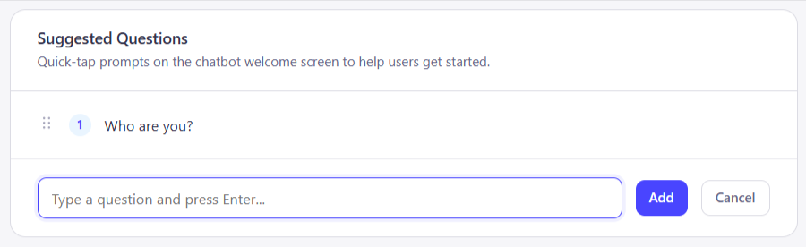

- **AI Instructions**
  - System Instrcutions : Used in realtime querying. Sent while AI creates DB query
  - Response Tone : Used in the final response sent by AI.

    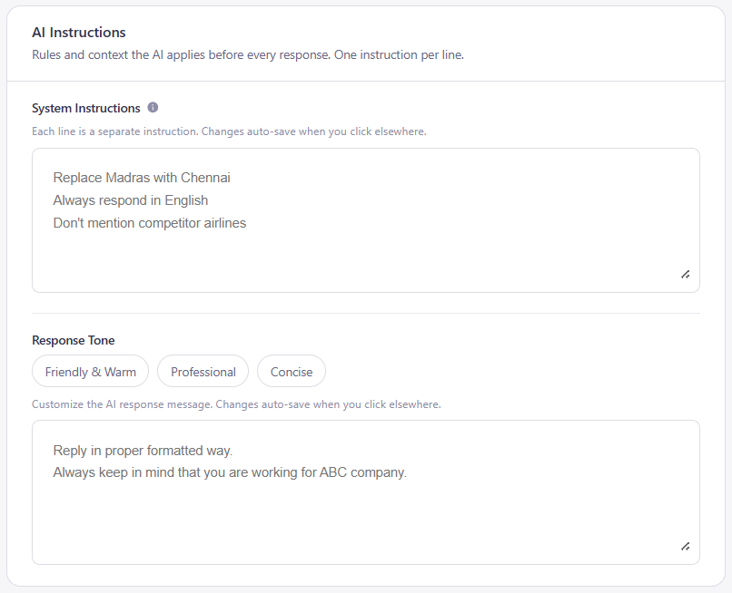

## 📚 Links

- [Strapi Docs](https://docs.strapi.io)
- [Developer Setup](./DEVELOPERS_README.md)
